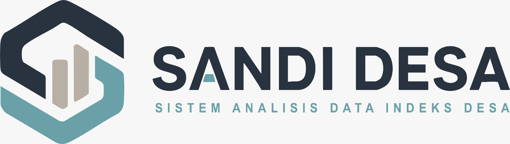

  

    <a href="https://lapor.go.id/" target="_blank" class="partner-logo">
      

      
    </a>

    <a href="https://ppid.kalbarprov.go.id/" target="_blank" class="partner-logo">
      

      
    </a>

    <a href="https://jdih.kalbarprov.go.id/" target="_blank" class="partner-logo">
      

      
    </a>

    <a href="https://sikedip.kalbarprov.go.id/" target="_blank" class="partner-logo">
      

      
    </a>
      
    <a href="https://sekampadi.kalbarprov.go.id/" target="_blank" class="partner-logo">
      

      
    </a>
      
      <a href="https://pkdkalbarprov-source.github.io/sandidesa/" target="_blank" class="partner-logo">
      

      
    </a>

  

