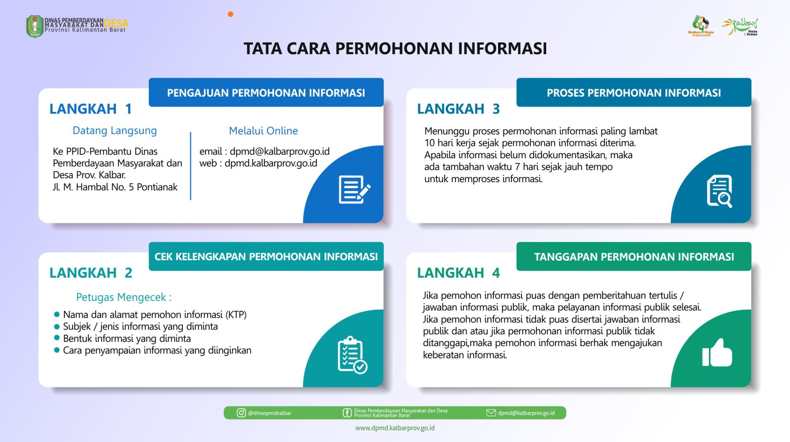
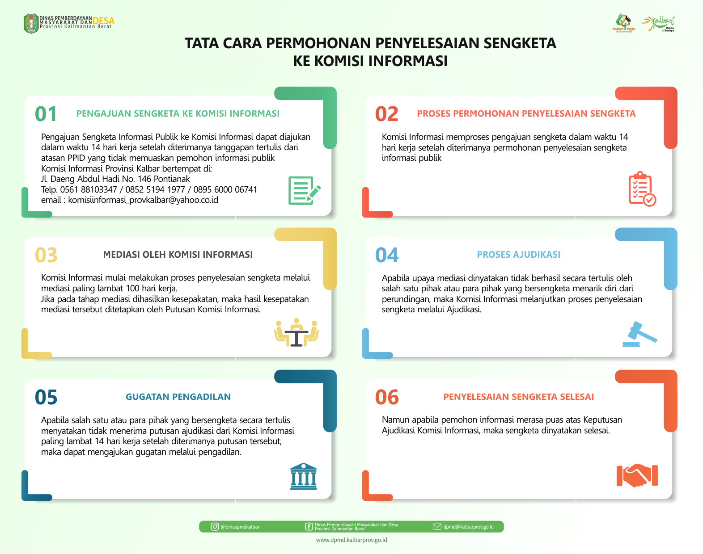
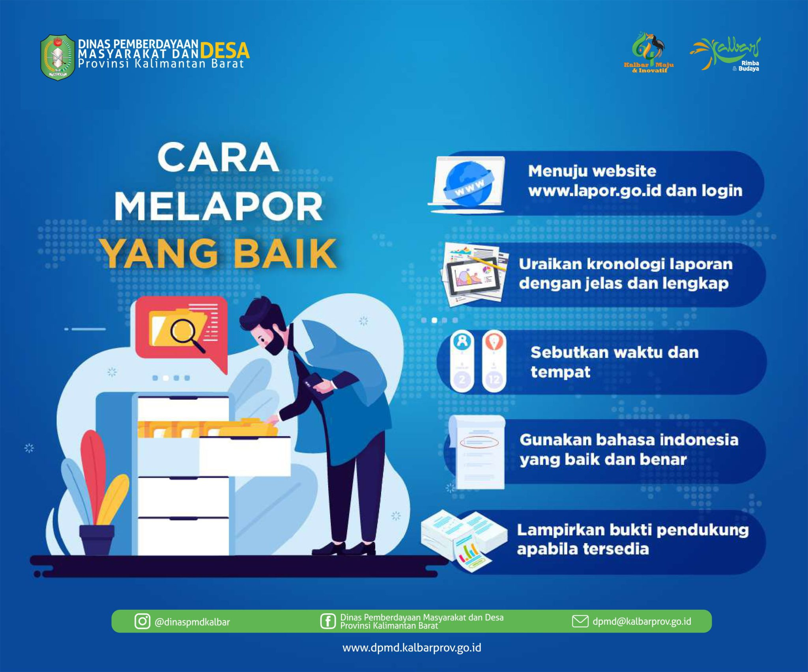
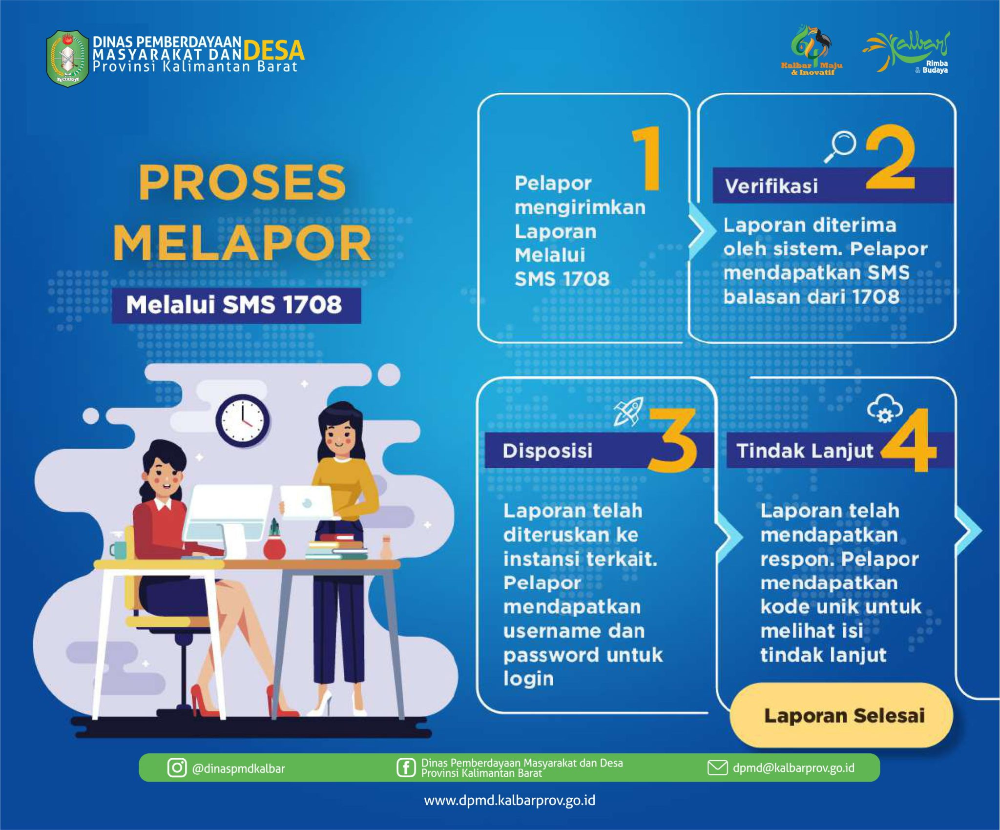

## Tata Cara Permohonan Informasi

## Tata cara memperoleh informasi publik

## Tata Cara Pengajuan Keberatan Informasi

## Tata Cara Pengajuan Permohonan Penyelesaian Sengketa ke Komisi Informasi

## SOP Tata Cara Pengaduan Penyalahgunaan Wewenang oleh Pejabat Badan Publik

